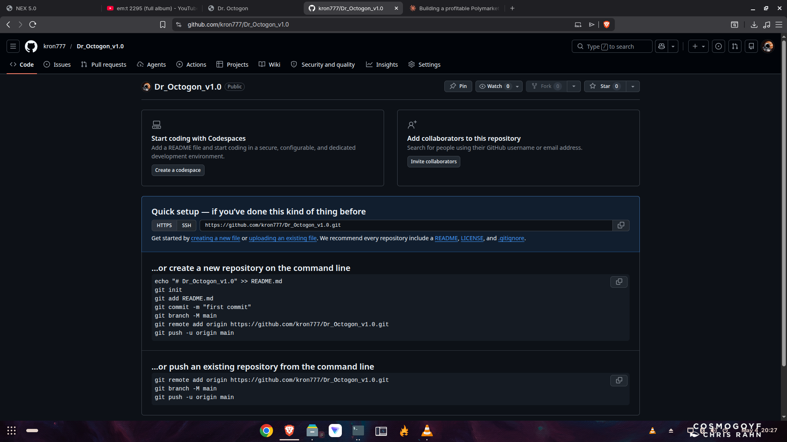

<div align="center">


# Dr. Octogon

**A research-analyst daemon that scans Polymarket, forecasts markets with an LLM, and trades the ones it can defend with primary sources.**

*v1.0 · phase 0 · paper-trading*

</div>

---

## Hey

Needed cash. Got tired of pretending the stock market made sense. Watched Polymarket markets sit at prices that felt obviously wrong and figured — if a model can read what I read and forecast what I forecast, but faster and without ego, maybe there's something there.

So I built Octogon.

It's not a "trading bot" in the YouTube-thumbnail sense. There's no MACD crossover, no neural net pretending to read order flow, no promise of passive income. It's a research analyst that happens to be an LLM, with a strict rule: **don't give a probability you can't cite.**

Most AI prediction systems hallucinate confidence. This one is built to refuse.

---

## Quick start

```bash
git clone https://github.com/kron777/Dr_Octogon_v1.0.git
cd Dr_Octogon_v1.0
python -m venv .venv && source .venv/bin/activate
pip install -r requirements.txt
python -m octagon.setup
```

The setup wizard will walk you through API keys and database init.

Then launch the daemon:

```bash
python -m octagon.main
```

Open the HUD: [http://127.0.0.1:7711](http://127.0.0.1:7711)

---

## What it does

Every 15 minutes, Octogon:

1. **Scans** ~500 markets from Polymarket's Gamma feed
2. **Triages** them down to candidates with real liquidity and near-term resolution
3. **Researches** each one — fetches news from Reuters, NYT, BBC, NPR, Politico, gov sources
4. **Forecasts** a probability via a large-context LLM (Cerebras-hosted, currently Qwen 3-235B)
5. **Refuses to forecast** anything where the evidence chain doesn't support a defensible number — flags it `unciteable=True` and walks away
6. **Paper-trades** when the forecast deviates from market price beyond a configurable edge band, with hard position-sizing, daily-loss caps, and a kill switch
7. **Logs everything** to a SQLite ledger for calibration analysis once enough markets resolve

The system is currently in **Phase 0 — read-only data collection.** No real money has been wagered. The Polymarket account is funded ($10) but `LIVE_TRADING_ENABLED=False` until the calibration data justifies the flip.

---

## The HUD

<div align="center">

</div>

Local browser dashboard at `127.0.0.1:7711`. Real-time SSE updates. Eight instrument panels:

- **ARM 1 — Scanner:** markets currently being researched
- **ARM 2 — Top Edges:** best-of-day forecast vs market deviations
- **ARM 3 — Recent Predictions:** last 12 forecasts with citation status
- **ARM 4 — Calibration:** Brier scoring (activates at 50 resolved predictions)
- **ARM 5 — Sources:** which publishers are actually returning data
- **ARM 6 — Citation:** rolling 7-day citeability rate
- **ARM 7 — Pending:** open predictions awaiting market resolution
- **ARM 8 — Resolutions:** last 8 resolved markets and how Octogon's forecast compared

Plus a **Freq Lever** with a 10-position aggression slider — from `P01_Hibernate` (20pp edge floor, $0.25 max stake) to `P10_Nuclear` ($100 stakes, 1.5pp floor). Auto mode sets the position from current bankroll. Manual mode lets you override, with a red warning when you're driving above your bankroll's weight class.

---

## Architecture

```
┌─────────────────────────────────────────────────────────────────┐
│                       OCTAGON DAEMON                            │
│                                                                 │
│   octagon_main.py  ──────►  every 15 min cycle                  │
│        │                                                        │
│        ├──►  octagon_scanner.py        Gamma + CLOB feeds       │
│        ├──►  octagon_triage.py         depth, time-to-resolve   │
│        ├──►  octagon_research.py       criteria + forecast      │
│        │         │                                              │
│        │         ├──►  octagon_sources.py    Google News RSS    │
│        │         │                           whitelisted pubs   │
│        │         │                                              │
│        │         ├──►  Cerebras Inference   criteria parser     │
│        │         │                          (Llama 3.1 8B)      │
│        │         │                                              │
│        │         └──►  Cerebras Inference   forecaster          │
│        │                                    (Qwen 3-235B)       │
│        │                                                        │
│        ├──►  octagon_executor.py       8 hard constraints       │
│        │         │                                              │
│        │         ├──►  STOP file kill switch                    │
│        │         ├──►  unciteable filter                        │
│        │         ├──►  edge floor + ceiling                     │
│        │         ├──►  Quarter-Kelly sizing                     │
│        │         ├──►  Tier max-stake cap                       │
│        │         ├──►  Daily loss cap                           │
│        │         ├──►  First-trade 60s confirmation             │
│        │         └──►  LIVE_TRADING_ENABLED gate                │
│        │                                                        │
│        ├──►  octagon_ledger.py         SQLite                   │
│        │                                                        │
│        └──►  octagon_resolution_watcher.py                      │
│                  closes trades + computes P&L                   │
│                                                                 │
└────────────────────────┬────────────────────────────────────────┘
                         │
                         ▼
              ┌──────────────────────┐
              │  octagon_hud_server  │
              │  127.0.0.1:7711      │
              │  SSE + JSON state    │
              └──────────────────────┘
```

---

## Citation discipline

This is the part that took the most thinking.

LLMs lie confidently. Ask Qwen "what's the probability X happens" and it will give you 0.7 with three paragraphs of justification, all of which it just made up. The justification *sounds* reasoned because LLMs are trained to sound reasoned.

Octogon's forecaster prompt forces a different shape:

1. State a base rate. **You must cite the source for the base rate.**
2. List adjustments. **Each adjustment must cite a primary source.**
3. If you cannot cite, set `unciteable=True` and refuse to provide a number.

The whitelist of "primary sources" is curated — Reuters, NYT, WaPo, BBC, NPR, AP, government domains (`*.gov`), Politico, Axios, The Hill. Prediction-market commentary, aggregators, and forum posts are blacklisted.

When the forecaster can't ground its forecast, it says so. Those predictions go into the database for analysis but are **never traded**.

In practice, ~35% of forecasts come back citeable. The other 65% are silenced before they can hurt you. That's the discipline.

---

## The freq lever

Ten positions. Each maps to a tier of trading aggression:

| Pos | Label | Min Edge | Max Stake | Daily Cap | Sane Bankroll |
|-----|-------|----------|-----------|-----------|---------------|
| 1 | Hibernate | 20pp | $0.25 | $1 | any |
| 2 | Cautious | 15pp | $0.50 | $2 | any |
| 3 | Default | 10pp | $0.50 | $2 | $10+ |
| 4 | Active | 7pp | $1.00 | $5 | $25+ |
| 5 | Engaged | 5pp | $2.00 | $10 | $100+ |
| 6 | Aggressive | 4pp | $5.00 | $25 | $250+ |
| 7 | Hot | 3pp | $10.00 | $50 | $500+ |
| 8 | Burning | 2.5pp | $25.00 | $125 | $1000+ |
| 9 | Furnace | 2pp | $50.00 | $250 | $2500+ |
| 10 | Nuclear | 1.5pp | $100.00 | $500 | $5000+ |

**Auto mode** picks the highest position your current bankroll supports. Lose money, drop a tier. Gain money, unlock the next.

**Manual mode** lets you override. The HUD shows a red warning if you've cranked the slider above your bankroll's weight class. The system respects your choice anyway — assumes you know what you're doing — but it makes you look at the warning every time you load the dashboard.

The slider is the steering wheel. The bankroll is the fuel. You can't drive faster than you can refuel.

---

## Stack

| Layer | Tech |
|-------|------|
| Runtime | Python 3.12 |
| LLM | Cerebras Inference (Qwen 3-235B forecaster, Llama 3.1 8B criteria parser) |
| HTTP | httpx (async) |
| HTML parsing | BeautifulSoup |
| Search | Google News RSS (no API key) |
| Database | SQLite |
| Logging | structlog (JSON) |
| HUD | Vanilla HTML + CSS + SSE — no framework, no React, no JS bloat |
| Hosting | Single Linux box, Zorin OS |

Architecture choices that mattered:

- **Local SQLite, not cloud DB.** This system needs to be honest with itself. No round-trips to Postgres. No "eventually consistent" anything. The ledger is the truth.
- **No web framework.** The HUD is a single `index.html` and a stdlib HTTP server. Loads in 50ms. No build step.
- **Async by default.** Source fetching and LLM calls run concurrently with bounded semaphores. Cycles complete in <1 minute even with 10 candidates.
- **Citation discipline at the prompt level.** Not post-hoc filtering. The forecaster is told from the start that uncited claims must be flagged.

---

## Configuration

All knobs live in `octagon_config.py`. Most are environment-variable overridable.

Important ones:

```python
LOOP_INTERVAL_SECONDS = 900           # 15-min scan cycle
MAX_HOURS_TO_RESOLUTION = 336         # 2-week horizon
MAX_MARKETS_PER_SCAN = 500
LIVE_TRADING_ENABLED = False          # safety default
STARTING_BANKROLL_USD = 10.00
RESEARCH_SPACING_SECONDS = 8          # space LLM calls within a cycle
```

The freq lever lives in `freq_lever.json` at the repo root. Edited via the HUD; CLI editing is allowed but the HUD is faster.

`.env` holds API keys. Never committed. Looks like:
```
CEREBRAS_API_KEY=csk-xxx
ANTHROPIC_API_KEY=sk-ant-xxx   # optional, for swap-back to Claude
```

---

## Status

Real numbers as of v1.0:

- **Predictions logged today:** ~25
- **Citation rate:** ~35%
- **Trades placed:** 1 (paper, open)
- **Brier scoring:** activates at 50 resolutions, currently 27
- **Bankroll:** $10 starting, $9.50 available, $0.50 paper exposure
- **Daemon uptime:** continuous since launch

It's not making money yet. It's not supposed to. **Phase 0 is data collection.** Once the calibration curve has signal — Brier score below ~0.22 across 50+ resolved predictions — the next decision is whether to flip live.

The honest expected outcome at $10 bankroll: ±$5 over the next 30 days, mostly noise. The data is the product, not the dollars.

---

## Roadmap

**v1.0 — Phase 0 (now)**
- Read-only data collection
- Paper trading only
- Calibration curve accumulation
- Source-fetcher debugging (consent-gate workaround → snippet-only evidence)

**v1.1 — Phase 1 (next 2-4 weeks)**
- Brier scoring activated
- Source coverage expanded (consent-gate bypass for full article fetch)
- Forecaster swap-back to Anthropic Opus 4.7 when card billing resolves
- Tier promotion gating on resolved-trade count + Brier threshold

**v2.0 — Phase 2 (when calibration justifies)**
- py-clob-client integration for live Polymarket order placement
- Tier T1 ($25 bankroll) graduation
- Real money, real consequences, same constraints

**v3.0 — long term**
- Sports markets extension (different forecaster, different sources)
- Multi-market portfolio sizing (correlated positions)
- Drawdown-triggered pause logic

---

## What this isn't

- Not financial advice
- Not for sale
- Not a get-rich scheme
- Not a "1000% APY" anything
- Not running with real money yet
- Not safe to fork and run blindly — the system is tuned for a specific bankroll and risk tolerance

If you found this repo by accident, you weren't supposed to. It's personal infrastructure that happens to live on GitHub for backup.

---

## Acknowledgements

Built solo, in Cape Town, May 2026.

The forecaster runs on Cerebras Inference's wafer-scale chips. The discipline came from getting humbled by overconfident LLM outputs many times before I learned to make the system refuse.

The mascot is Doctor Octogon — *the mind behind the machine.*

